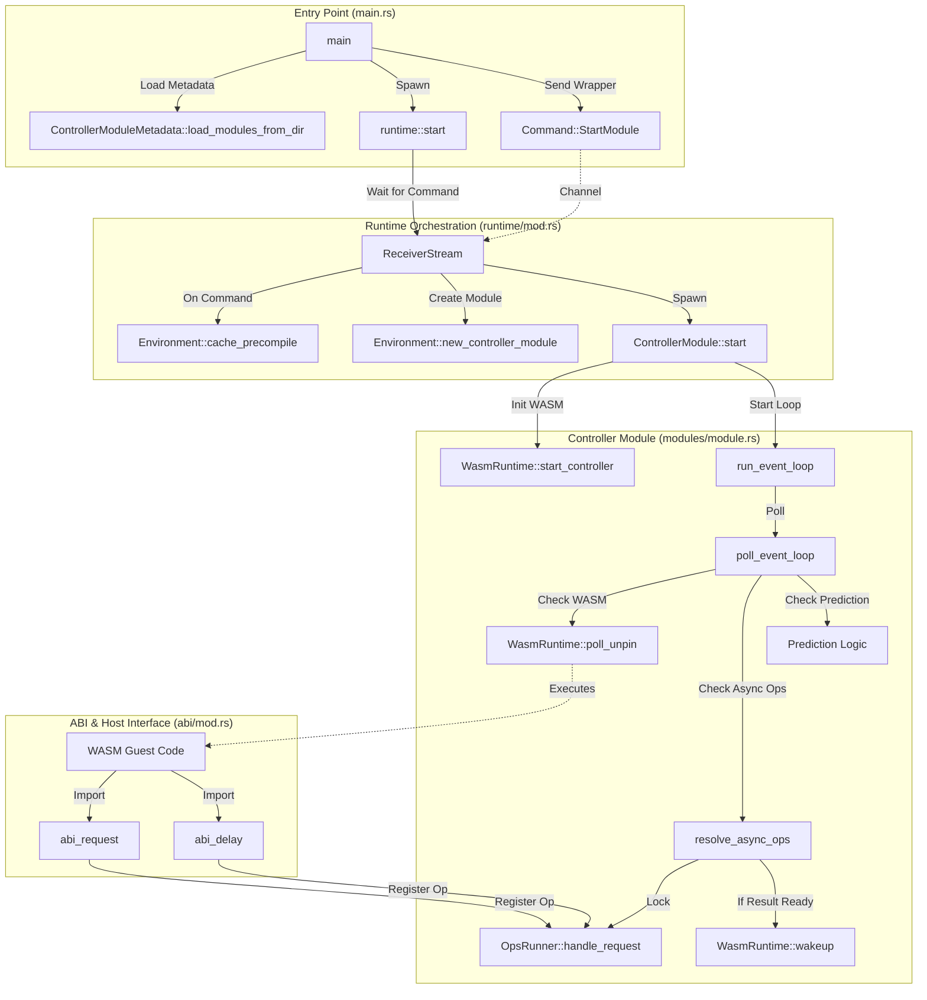

# Callgraph for pkg/controller

This diagram illustrates the initialization flow and the runtime event loop interactions between the Rust host and the WASM modules.

## Initialization & Execution Flow

## detailed Interaction Loop

1. **Bootstrap**: `main` initializes the runtime and sends a `StartModule` command.
2. **Instantiation**: `runtime::start` receives the command, compiles the WASM (if needed), and creates a `ControllerModule`.
3. **Execution**: `ControllerModule::start` kicks off the `_start` function in WASM.
4. **Event Loop**:
    - The module polls the WASM instance.
    - If the WASM guest needs to perform an I/O operation (like an HTTP request), it calls the host function via ABI (`abi_request`).
    - The host registers this operation in `OpsRunner`.
    - The `ControllerModule`'s `resolve_async_ops` checks for completed operations.
    - When an operation completes, `WasmRuntime::wakeup` is called to notify the WASM guest with the result.
